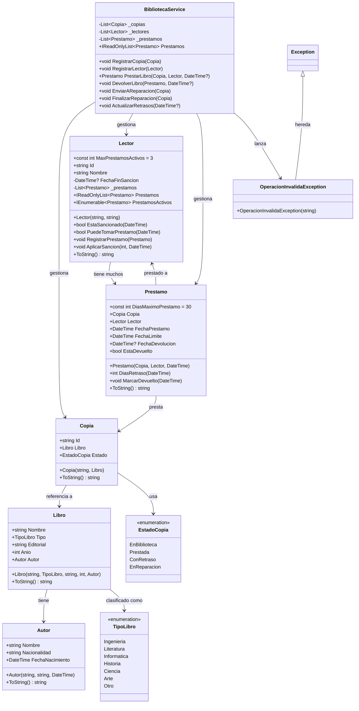

# Diagrama de Clases - BibliotecaSystem

## Descripción del Sistema

### 📚 Modelos (Carpeta: `Modelos/`)
| Clase | Descripción |
|-------|-------------|
| **Autor** | Información del autor (nombre, nacionalidad, fecha nacimiento) |
| **Libro** | Obra con tipo, editorial, año y autor |
| **Copia** | Ejemplar físico de un libro con estado |
| **Lector** | Usuario de la biblioteca con historial de préstamos |
| **Préstamo** | Asociación copia-lector con período de 30 días |

### 📋 Enumeraciones (Carpeta: `Enums/`)
| Enum | Valores |
|------|---------|
| **EstadoCopia** | EnBiblioteca, Prestada, ConRetraso, EnReparacion |
| **TipoLibro** | Ingenieria, Literatura, Informatica, Historia, Ciencia, Arte, Otro |

### ⚙️ Servicios (Carpeta: `Servicios/`)
| Clase | Responsabilidad |
|-------|-----------------|
| **BibliotecaService** | Orquesta las reglas de negocio: préstamos, devoluciones, sanciones |
| **OperacionInvalidaException** | Excepción para operaciones inválidas |

### 🔗 Relaciones Principales
- Un **Libro** tiene un **Autor**
- Una **Copia** referencia a un **Libro** y tiene un **EstadoCopia**
- Un **Lector** puede tener múltiples **Préstamos**
- Un **Préstamo** vincula una **Copia** con un **Lector**
- El **BibliotecaService** gestiona todas las entidades
